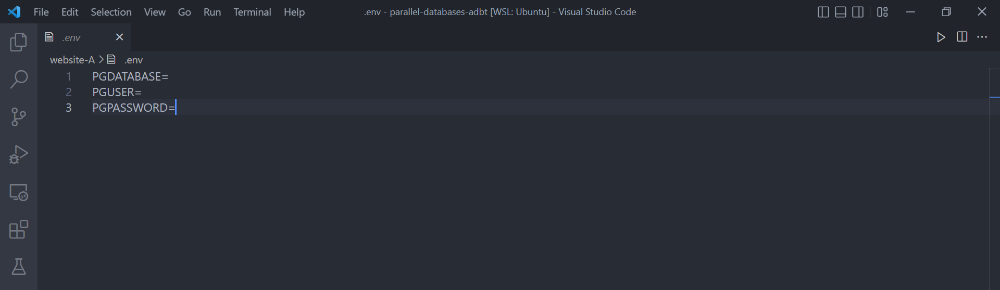

# Parallel Databases

This is lab practical of Advanced Database Technology for implementing Parallel Databases.

## Getting Started

To run this project:

1. Clone the repository or Download ZIP.
2. Install Dependencies with `pip install -r requirements.txt`
3. Create a new [postgresql](https://www.postgresql.org/download/) database.
4. Create `.env` file inside both the websites and provide the credentials to the database as shown in the image:

### Website A

* Run `flask run` or `python app.py`

It runs the app in development mode. Open [http://127.0.0.1:5000](http://127.0.0.1:5000) to view it in the browser.

### Website B

* Run `flask run` or `python app.py`

It runs the app in development mode. Open [http://127.0.0.1:8000](http://127.0.0.1:8000) to view it in the browser.

You have successfully connected two websites to a single database!
